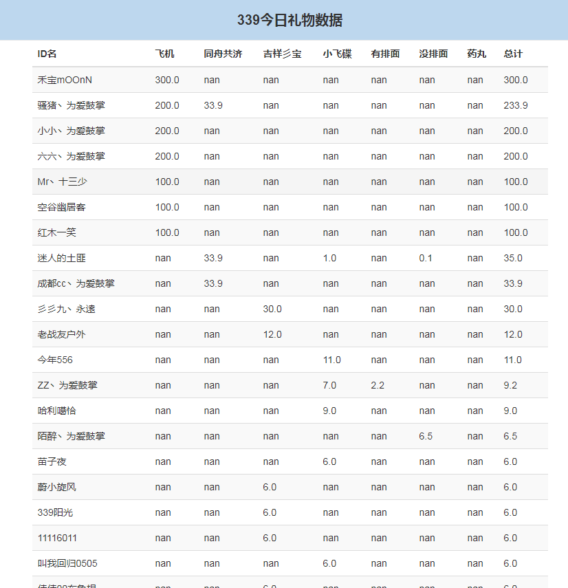

## 运行环境

anaconda3.6 + MongoDB4.0

#### 直接运行

`python bin/run.py`

(需要更改一下配置文件conf.py)

默认抓取了我关注的几个房间，用户可在conf/settings.py文件中配置

另外单独做了统计礼物收入`python count_gift.py`统计当天的礼物收入

还用WordCloud做了词云（这个做的时间比较早，不确定还能不能运行）

最终，想做一个网页，显示房间某天收到的礼物，效果大致如图（可以另开一个项目展示，这个项目只是抓取数据）

------

2018-11-9

http://open.douyucdn.cn/api/RoomApi/room/roomid（roomid改为房间的id）接口失效，无法查询某房间所对应的礼物